//Caribe Supply E-commerce: Catálogo y Venta al Detalle//
Descripción Ejecutiva del Proyecto
Caribe Supply es una plataforma de comercio electrónico dinámica y responsiva, construida con React y Bootstrap, diseñada para la venta y distribución de productos variados, incluyendo plásticos, artículos del hogar y accesorios.

El objetivo principal es ofrecer a los clientes una experiencia de navegación fluida, permitiéndoles filtrar, paginar y visualizar productos de manera eficiente, optimizando tanto el rendimiento como la accesibilidad. El sistema utiliza el enrutamiento de React Router DOM para simular la navegación entre el catálogo, el carrito y el proceso de checkout.

 -Tecnologías y Servicios Utilizados
-Tecnologías Core
Frontend Principal: React v18+ (Construcción de la interfaz de usuario).

Estilos y Diseño: Bootstrap 5 (Estructura responsiva y componentes de UI).

Navegación: React Router DOM (Enrutamiento de URL entre Catálogo, Home, About).

 --APIs y Servicios--
Datos de Productos: JavaScript Array (productsData.js).

Tipo de API: Local/Mock Data (Almacenamiento simulado de la base de datos de productos).

Mapa de Ubicación: Google Maps Embed (iframe).

Tipo de API: API de Incrustación (Embed API).

Propósito: Muestra la ubicación de la tienda en el componente About.

Lógica de Estado: React Hooks (useState, useEffect, useCallback).

Propósito: Gestión interna del estado, la sincronización de datos y optimización de funciones.

--------- Problemas Técnicos Resueltos--------------
Esta sección documenta los desafíos técnicos clave y las soluciones implementadas para garantizar la funcionalidad y las mejores prácticas de React.

1. Sincronización de Filtros y Paginación
Problema: Inicialmente, la lógica de paginación y filtrado fallaba o entraba en bucles debido a la desincronización entre el estado local de React (useState) y los parámetros de la URL (searchParams).

Solución: Se implementó la Estrategia "URL-Primero". Se eliminó el uso de useState para la categoría y la página, forzando al componente Catalogo.jsx a leer los valores directamente de location.search en cada render. Esto aseguró que la vista siempre refleje la URL más reciente.

2. Conflicto de Componentes de Navegación
Problema: El uso del componente <Link to="#"> para los botones de filtro, combinado con el onClick que iniciaba la navegación con Maps(), causaba conflictos en el enrutamiento y, a veces, interrumpía la acción del filtro.

Solución: Se reemplazó el componente <Link> por un <button> simple en la lista de filtros del catálogo. Esto eliminó el conflicto de enrutamiento y la necesidad de usar e.preventDefault() en la función, simplificando el handler.

3. Advertencias de Dependencias de React Hooks (ESLint)
Problema: La consola mostraba advertencias (react-hooks/exhaustive-deps) debido a la omisión de dependencias (activeCategory, currentPage) dentro del useEffect, lo cual comprometía la eficiencia.

Solución: Se incluyeron todas las variables de estado utilizadas en el array de dependencias del useEffect. Además, la función updateUrl fue encapsulada en useCallback para evitar su recreación innecesaria en cada render.

4. Accesibilidad y Usabilidad del Filtro (a11y)
Problema: La solución intermedia de usar un ancla simple (<a href="#">) para el filtro generaba advertencias de accesibilidad (jsx-a11y/anchor-is-valid), ya que un elemento que ejecuta una acción debería ser un botón.

Solución: Se adoptó el estándar de accesibilidad correcto, manteniendo la etiqueta <button> para los filtros. Esto asegura que los lectores de pantalla y las herramientas de accesibilidad identifiquen correctamente la funcionalidad del elemento.

 Métricas de Rendimiento (Lighthouse)
(Resultado de las pruebas de rendimiento y accesibilidad)

---Capturas de pantalla---
Inicio de la página o home
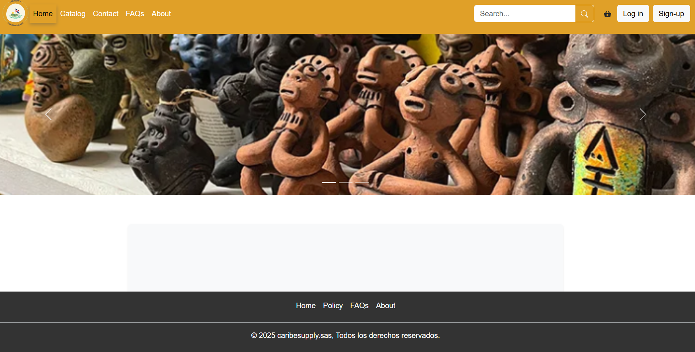
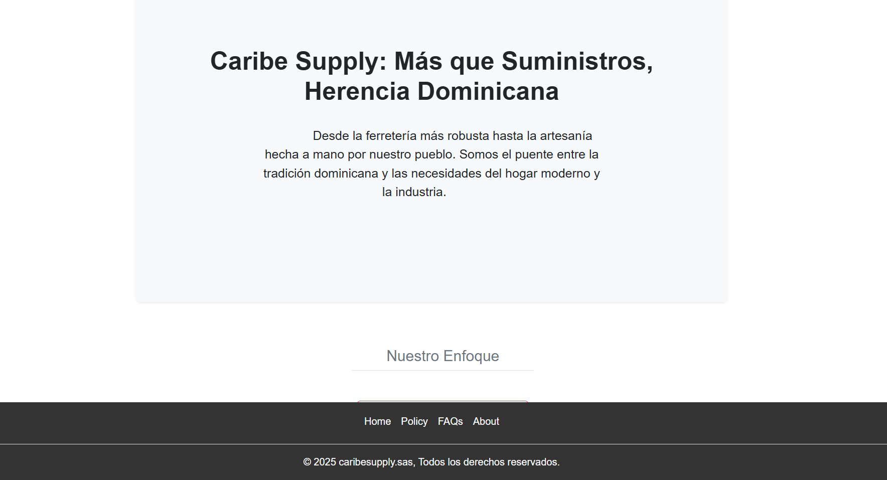
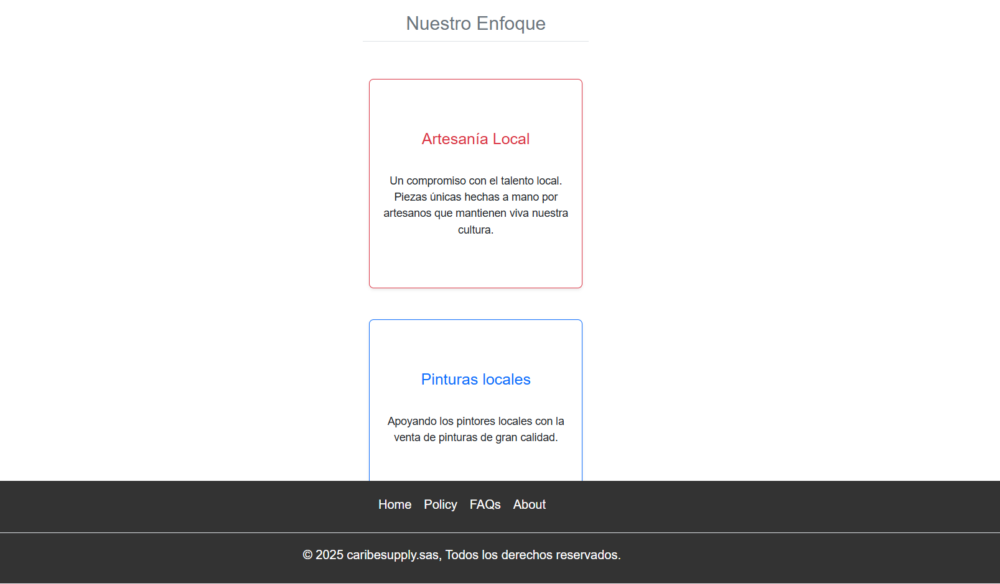
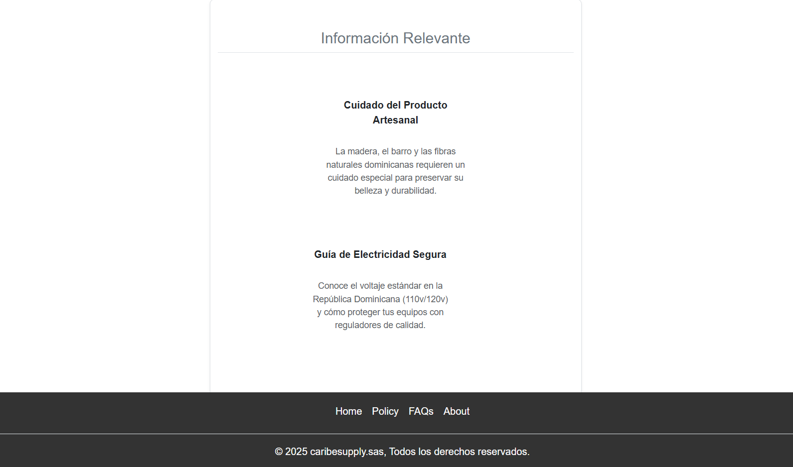
Catalogo y productos
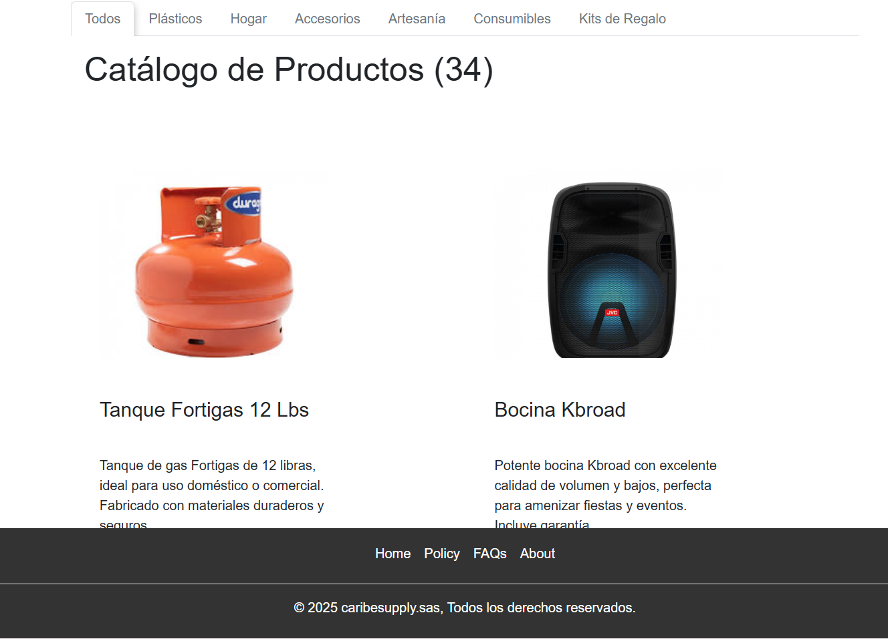
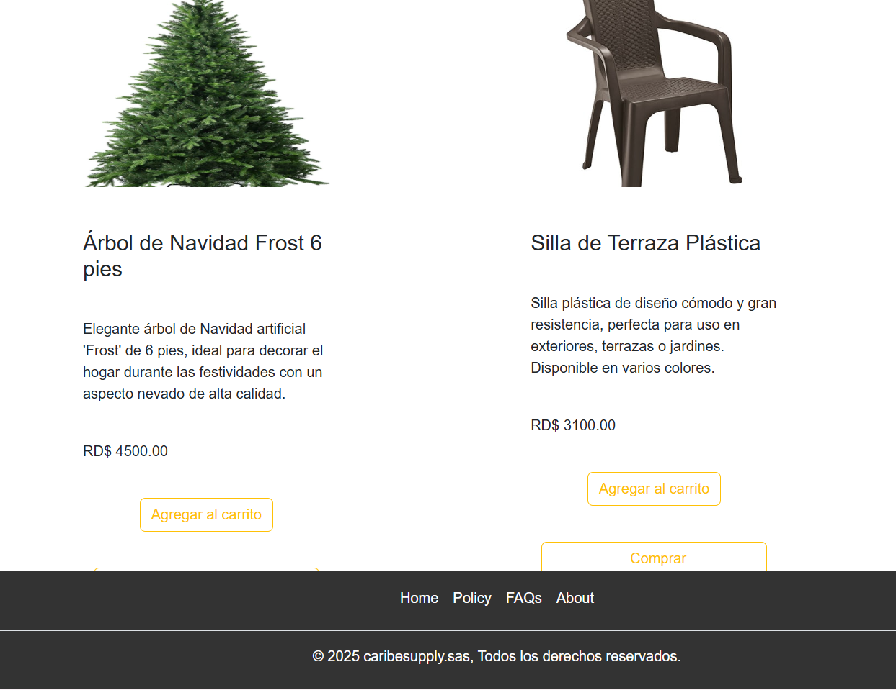
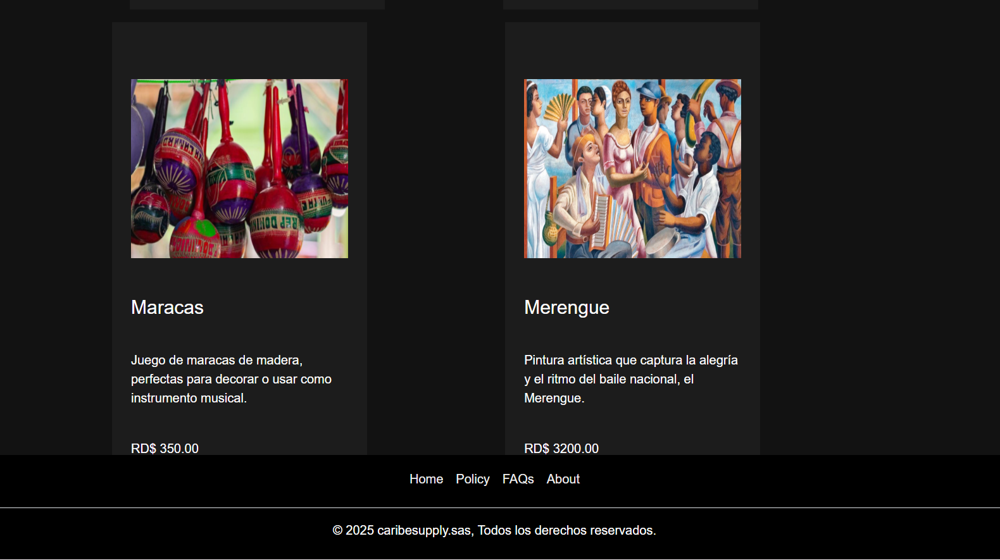
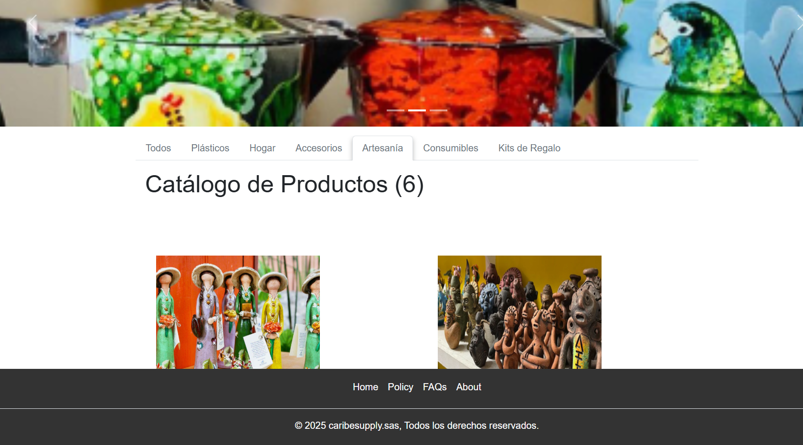
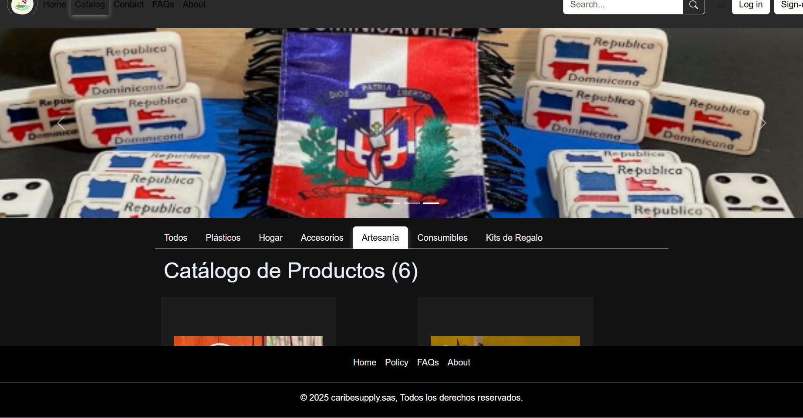
Carrito, CheckOut y Seguimiento
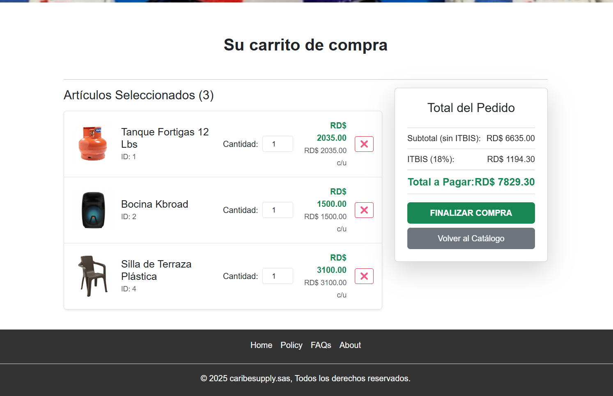
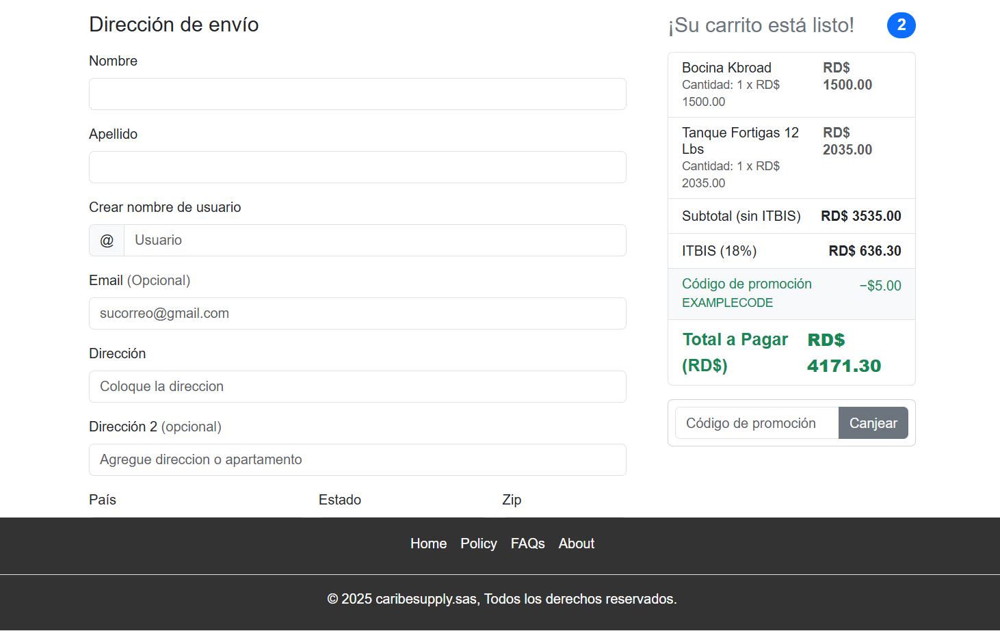
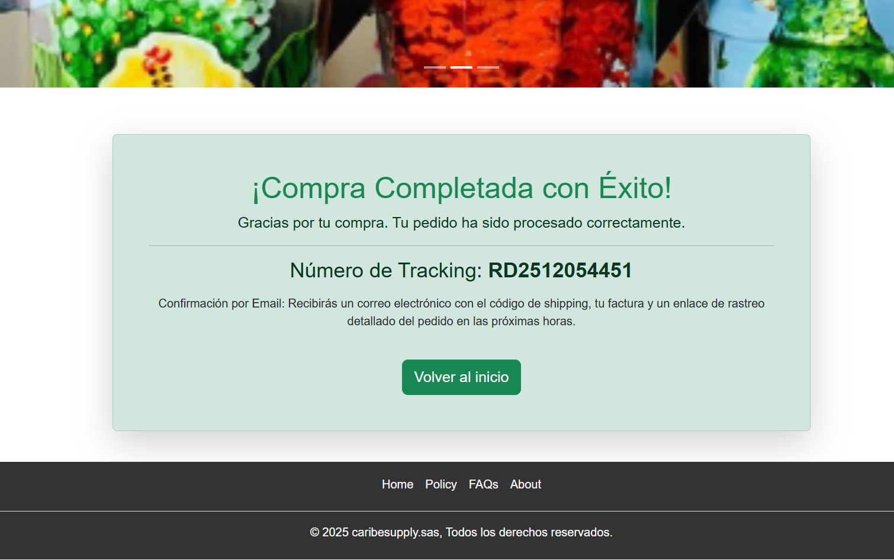
Contacto
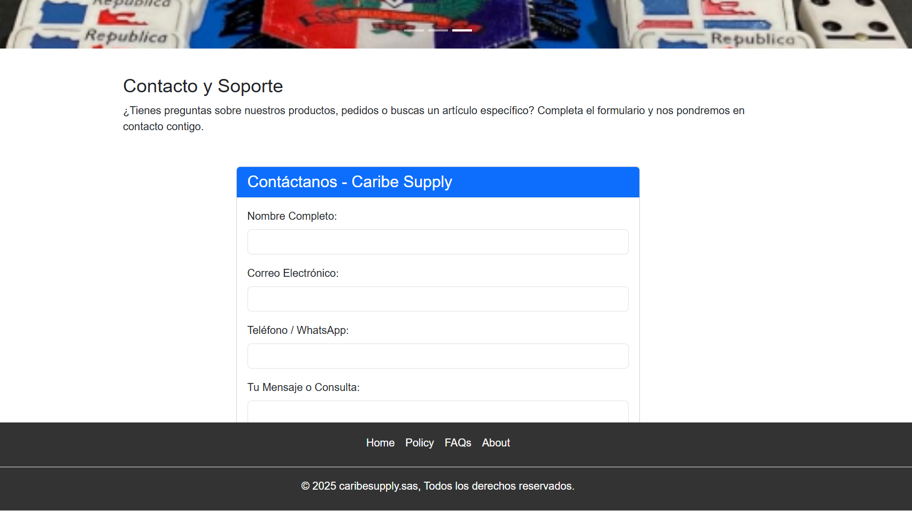
FAQ y About
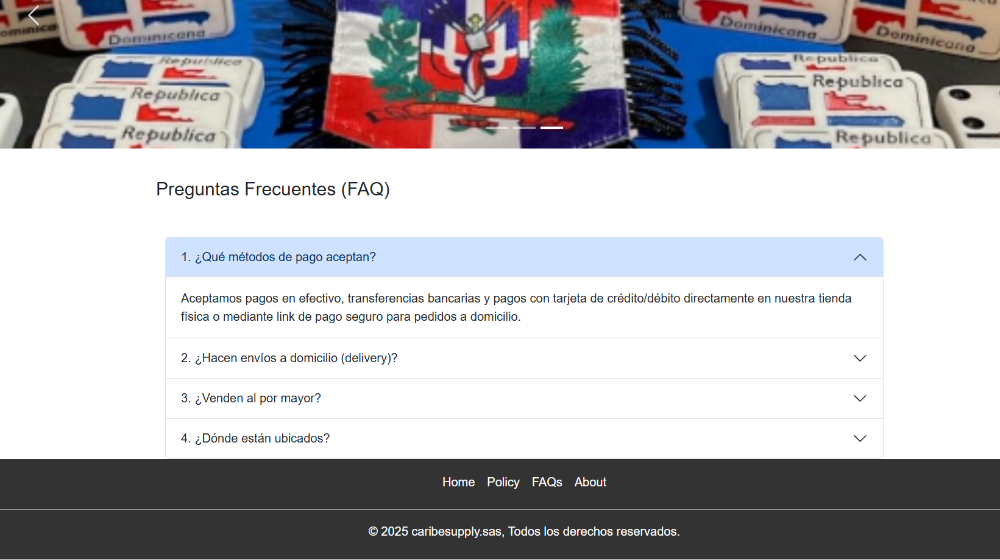
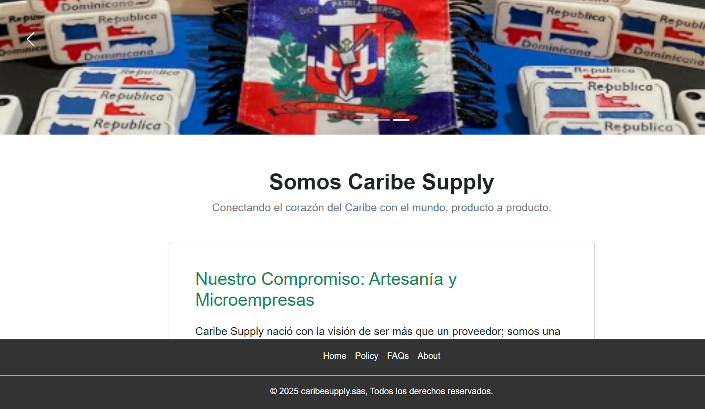
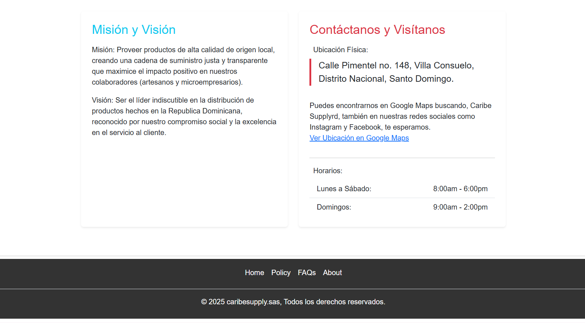
Inicio S. usuario/ Registro
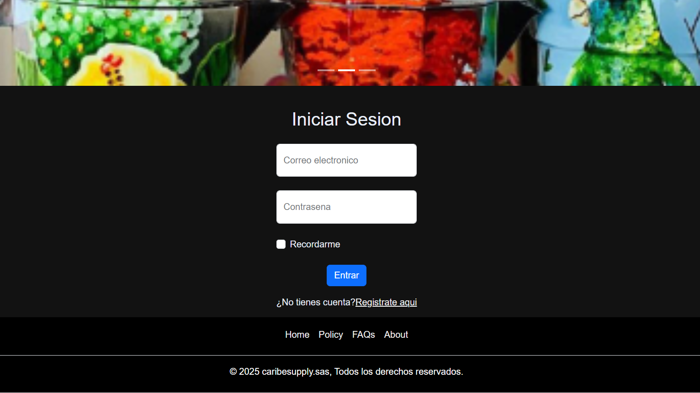

Rendimiento o metricas
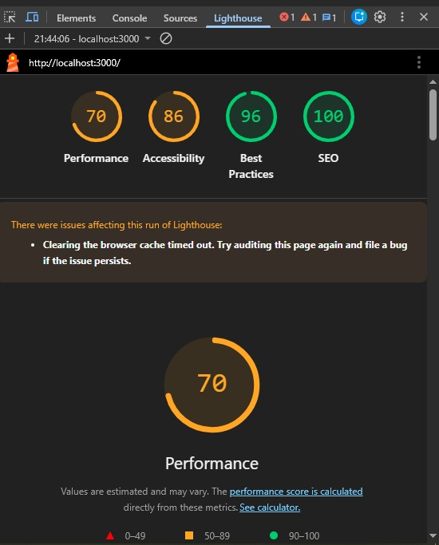

# Getting Started with Create React App

This project was bootstrapped with [Create React App](https://github.com/facebook/create-react-app).

## Available Scripts

In the project directory, you can run:

### `npm start`

Runs the app in the development mode.\
Open [http://localhost:3000](http://localhost:3000) to view it in your browser.

The page will reload when you make changes.\
You may also see any lint errors in the console.

### `npm test`

Launches the test runner in the interactive watch mode.\
See the section about [running tests](https://facebook.github.io/create-react-app/docs/running-tests) for more information.

### `npm run build`

Builds the app for production to the `build` folder.\
It correctly bundles React in production mode and optimizes the build for the best performance.

The build is minified and the filenames include the hashes.\
Your app is ready to be deployed!

See the section about [deployment](https://facebook.github.io/create-react-app/docs/deployment) for more information.

### `npm run eject`

**Note: this is a one-way operation. Once you `eject`, you can't go back!**

If you aren't satisfied with the build tool and configuration choices, you can `eject` at any time. This command will remove the single build dependency from your project.

Instead, it will copy all the configuration files and the transitive dependencies (webpack, Babel, ESLint, etc) right into your project so you have full control over them. All of the commands except `eject` will still work, but they will point to the copied scripts so you can tweak them. At this point you're on your own.

You don't have to ever use `eject`. The curated feature set is suitable for small and middle deployments, and you shouldn't feel obligated to use this feature. However we understand that this tool wouldn't be useful if you couldn't customize it when you are ready for it.

## Learn More

You can learn more in the [Create React App documentation](https://facebook.github.io/create-react-app/docs/getting-started).

To learn React, check out the [React documentation](https://reactjs.org/).

### Code Splitting

This section has moved here: [https://facebook.github.io/create-react-app/docs/code-splitting](https://facebook.github.io/create-react-app/docs/code-splitting)

### Analyzing the Bundle Size

This section has moved here: [https://facebook.github.io/create-react-app/docs/analyzing-the-bundle-size](https://facebook.github.io/create-react-app/docs/analyzing-the-bundle-size)

### Making a Progressive Web App

This section has moved here: [https://facebook.github.io/create-react-app/docs/making-a-progressive-web-app](https://facebook.github.io/create-react-app/docs/making-a-progressive-web-app)

### Advanced Configuration

This section has moved here: [https://facebook.github.io/create-react-app/docs/advanced-configuration](https://facebook.github.io/create-react-app/docs/advanced-configuration)

### Deployment

This section has moved here: [https://facebook.github.io/create-react-app/docs/deployment](https://facebook.github.io/create-react-app/docs/deployment)

### `npm run build` fails to minify

This section has moved here: [https://facebook.github.io/create-react-app/docs/troubleshooting#npm-run-build-fails-to-minify](https://facebook.github.io/create-react-app/docs/troubleshooting#npm-run-build-fails-to-minify)

